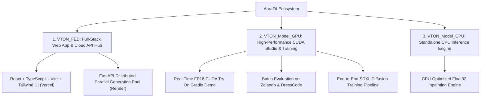
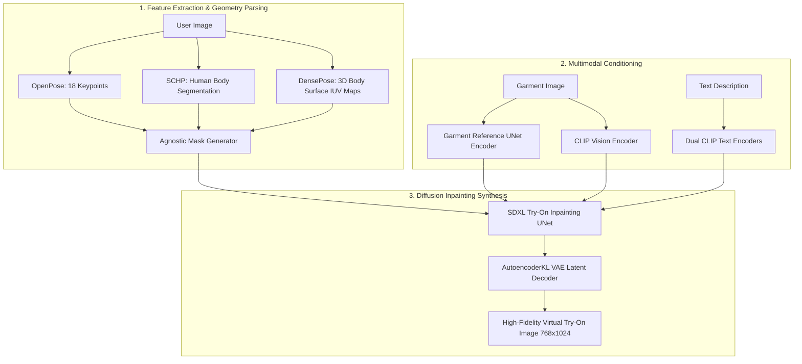

# 👕 AuraFit — Next-Generation AI Virtual Try-On Platform

> **AuraFit** is an enterprise-grade, end-to-end Virtual Try-On (VTON) ecosystem powered by generative diffusion models, human pose estimation, and body surface parsing. It delivers hyper-realistic garment transfer across diverse apparel styles and human body shapes with real-time browser preview, cloud-distributed parallel generation, and dedicated local CUDA/CPU inference suites.

[](https://aurafit-phi.vercel.app/)
[](https://aurafit-backend-ql0b.onrender.com/genders)
[](https://aurafit-backend-ql0b.onrender.com/docs)


---

## 🌟 Live Production Deployments

* 🖥️ **Live Web Application (Vercel)**: **[https://aurafit-phi.vercel.app](https://aurafit-phi.vercel.app/)**
* ⚡ **Production API Gateway (Render)**: **[https://aurafit-backend-ql0b.onrender.com](https://aurafit-backend-ql0b.onrender.com)**
* 📚 **Interactive Swagger API Documentation**: **[https://aurafit-backend-ql0b.onrender.com/docs](https://aurafit-backend-ql0b.onrender.com/docs)**

---

## 📌 Executive Summary

AuraFit transforms the digital fashion and e-commerce experience by bridging the gap between flat catalog browsing and realistic garment visualization. By combining **Stable Diffusion XL (SDXL)** with **garment reference UNets**, **DensePose 3D surface mapping**, and **SCHP human parsing**, AuraFit accurately wraps clothing while preserving original textile patterns, drape dynamics, body contours, and lighting conditions.

The repository is organized into three purpose-built packages:



---

## 🏛️ Repository Architecture

| Package | Primary Role | Core Stack | Target Deployment |
|---|---|---|---|
| **[`VTON_FED`](./VTON_FED/README.md)** | **Full-Stack Web App & Distributed Cloud API** | React 18, Vite, TypeScript, TailwindCSS, FastAPI, Hugging Face Inference Pool | Web production, e-commerce storefronts, cloud-scaled inference |
| **[`VTON_Model_(GPU)`](./VTON_Model_(GPU)/README.md)** | **Local GPU Engine, Benchmarking & Training** | PyTorch, CUDA 11.8+, Diffusers (SDXL), DensePose, OpenPose, Accelerate | Workstations with NVIDIA GPUs (RTX 3080/4090, A100), AI research & model training |
| **[`VTON_Model_(CPU)`](./VTON_Model_(CPU)/README.md)** | **Standalone CPU Inference Engine** | PyTorch CPU, Float32, Diffusers, Gradio 4.x UI | Local desktops/laptops without dedicated NVIDIA graphics |

---

## 🔬 Deep Learning Technology Stack



### Core Deep Learning Modules:
- **Inpainting UNet (`UNet2DConditionModel`)**: Modified SDXL inpainting model accepting concatenated noisy latents, agnostic person masks, and DensePose condition maps.
- **Garment Reference UNet (`UNet2DConditionModel_ref`)**: Dedicated feature-extractor UNet ensuring high-frequency texture, embroidery, and logo preservation.
- **DensePose (Detectron2)**: Incorporates 3D human body surface parametrization to avoid flat 2D clothing pasting.
- **SCHP (Self-Correction Human Parsing)**: Cleanly isolates original garments while preserving human identity, face, hair, and limbs.
- **Dual CLIP Encoders**: Multimodal text and image embeddings leveraging `CLIPVisionModelWithProjection` and `CLIPTextModel`.

---

## 🚀 Quick Start Guide

### 1. Full-Stack Web Platform (`VTON_FED`)

AuraFit FED consists of a React 18 e-commerce frontend and a FastAPI backend with distributed parallel generation.

#### Automated Launcher:
```powershell
cd d:\VTON\VTON_FED
.\start.ps1
```

#### Manual Development Setup:
```powershell
# Backend (FastAPI)
cd d:\VTON\VTON_FED\VTON-LOCAL
python -m venv venv
.\venv\Scripts\activate
pip install -r requirements.txt
uvicorn main:app --reload --port 8000

# Frontend (React + Vite)
cd d:\VTON\VTON_FED\tryon-studio-main
npm install
npm run dev
```

- **Frontend Dev URL**: `http://localhost:8080` (or `http://localhost:5173`)
- **Backend API Gateway**: `http://localhost:8000`
- **Swagger Documentation**: `http://localhost:8000/docs`

---

### 2. Local GPU Studio (`VTON_Model_(GPU)`)

For local NVIDIA GPU systems with CUDA:

```powershell
cd d:\VTON\VTON_Model_(GPU)

# 1. Setup CUDA environment (first time)
.\setup_gpu.ps1

# 2. Launch interactive Gradio studio
.\aurafit_gpu.ps1
```

- **Gradio Web Interface**: `http://localhost:7860`
- **Features**: Sub-second half-precision (`fp16`) try-on, interactive inpainting mask brush, batch dataset evaluation, and custom model training scripts.

#### Batch Evaluation on Benchmarks:
```bash
# VITON-HD / Zalando evaluation
accelerate launch inference.py --pretrained_model_name_or_path "./Model" --width 768 --height 1024 --num_inference_steps 30 --output_dir "result" --unpaired --data_dir "./Dataset/zalando"

# DressCode evaluation (Upper, Lower, Dresses)
accelerate launch inference_dc.py --pretrained_model_name_or_path "./Model" --category "upper_body" --output_dir "result" --data_dir "./Dataset/DressCode"
```

#### Fine-Tuning SDXL Try-On Model:
```bash
CUDA_VISIBLE_DEVICES=0,1,2,3 accelerate launch train_xl.py \
    --pretrained_model_name_or_path "./Model" \
    --gradient_checkpointing \
    --use_8bit_adam \
    --output_dir="./checkpoints/vton_custom" \
    --train_batch_size=6 \
    --data_dir="./Dataset/zalando" \
    --learning_rate=1e-5 \
    --max_train_steps=50000
```

---

### 3. Standalone CPU Engine (`VTON_Model_(CPU)`)

For machines running without dedicated NVIDIA graphics:

```powershell
cd d:\VTON\VTON_Model_(CPU)

# Automated CPU Launcher:
.\aurafit_cpu.ps1
```

- **Gradio Web Interface**: `http://localhost:7860`
- **Features**: Pure CPU tensor processing (`Float32`, `low_cpu_mem_usage=True`), optimized multi-threaded execution via `OMP_NUM_THREADS`.

---

## 📡 REST API Reference (`VTON_FED`)

| Endpoint | Method | Description | Parameters / Payload |
|---|---|---|---|
| `/genders` | `GET` | Retrieve supported catalog genders | None |
| `/categories` | `GET` | List garment sub-categories by gender | `gender` (e.g. `"Men"`, `"Women"`, `"Kids"`) |
| `/garments` | `GET` | List available garments in a category | `gender`, `category` (e.g. `"full wear/Kurtis"`) |
| `/generate-tryons` | `POST` | Execute 10 parallel try-ons | `multipart/form-data` (`gender`, `category`, `user_photo`) |
| `/health` | `GET` | System and worker health check | None |

### Sample Response (`POST /generate-tryons`):
```json
{
  "results": [
    "/output/tryon_1709123456_0.jpg",
    "/output/tryon_1709123456_1.jpg",
    "/output/tryon_1709123456_2.jpg"
  ],
  "errors": []
}
```

---

## 📂 Project Structure Map

```text
VTON/
├── README.md                          # Master ecosystem documentation (this file)
├── .gitignore                         # Git exclusion rules (dependencies, caches, binaries)
│
├── VTON_FED/                          # Full-Stack Web Application & API Hub
│   ├── render.yaml                    # Render Cloud deployment blueprint
│   ├── vercel.json                    # Vercel deployment routing configuration
│   ├── start.ps1                      # One-click full-stack build & launcher
│   ├── README.md                      # FED architecture and API reference
│   ├── VTON-LOCAL/                    # FastAPI Backend Service (Deployed on Render)
│   │   ├── main.py                    # Server entry point & static SPA host
│   │   ├── Garments/                  # Categorized garment catalog (Men, Women, Kids)
│   │   │   ├── Men/                   # Topwear (Shirts, T-Shirts, Hoodies)
│   │   │   ├── Women/                 # Full wear (Kurtis, Dresses), Topwear
│   │   │   └── Kids/                  # Kids collection
│   │   └── requirements.txt           # Backend Python dependencies
│   └── tryon-studio-main/             # React + Vite + Tailwind CSS Frontend (Deployed on Vercel)
│       ├── src/                       # React components, pages, context, and lib
│       │   ├── pages/                 # TryOnWizard, ProductGallery, ProductDetail, Checkout
│       │   ├── contexts/              # TryOnContext state management
│       │   └── lib/                   # API client and product catalog utilities
│       ├── package.json               # Frontend dependencies
│       ├── vite.config.ts             # Vite configuration
│       └── tailwind.config.ts         # Tailwind styling tokens
│
├── VTON_Model_(GPU)/                  # Local High-Performance GPU Suite
│   ├── aurafit_gpu.ps1                # GPU launcher script
│   ├── setup_gpu.ps1                  # PyTorch CUDA 11.8 automated installer
│   ├── README.md                      # GPU technical documentation
│   ├── requirements.txt               # GPU Python dependencies
│   ├── inference.py                   # Batch evaluation script (Zalando / VITON-HD)
│   ├── inference_dc.py                # Batch evaluation script (DressCode)
│   ├── train_xl.py                    # SDXL diffusion fine-tuning script
│   ├── configs/                       # Detectron2 DensePose configurations
│   ├── preprocess/                    # OpenPose and Human Parsing preprocessing
│   └── gradio_demo/                   # GPU Gradio interactive application
│       ├── app.py                     # Gradio UI application with inpainting brush
│       └── utils_mask.py              # Agnostic mask generators
│
└── VTON_Model_(CPU)/                  # Standalone CPU-Optimized Engine
    ├── aurafit_cpu.ps1                # CPU launcher script
    ├── README.md                      # CPU technical documentation
    ├── app.py                         # Root application runner
    ├── gradio_demo/                   # CPU Gradio interactive application
    │   └── app.py                     # CPU-adapted Gradio application
    └── src/                           # Diffusion pipelines and UNet modules
        ├── tryon_pipeline.py          # SDXL inpainting try-on pipeline
        ├── unet_hacked_tryon.py       # Modified Try-on UNet
        └── unet_hacked_garmnet.py     # Garment reference UNet
```

---

## 📊 Module Comparison

| Feature | `VTON_FED` | `VTON_Model_(GPU)` | `VTON_Model_(CPU)` |
|---|---|---|---|
| **User Interface** | React 18 E-Commerce SPA | Gradio 4.x Interactive GUI | Gradio 4.x Interactive GUI |
| **Inference Location** | Distributed HF Cloud Spaces | Local NVIDIA GPU | Local Host CPU |
| **Hardware Required** | Standard PC / Web Browser | NVIDIA GPU (>= 8–12 GB VRAM) | 4+ Core CPU (>= 16 GB RAM) |
| **Precision** | Cloud Managed | FP16 Half-Precision | Float32 Pure CPU |
| **Parallel Generations** | ✅ 10 items concurrently | Sequential / Batch scripts | Sequential |
| **Training & Fine-Tuning** | ❌ | ✅ Full SDXL Training Pipeline | ❌ |
| **Evaluation Benchmarks** | ❌ | ✅ VITON-HD / DressCode | ❌ |
| **Offline Operation** | ❌ (Requires Network) | ✅ 100% Local & Offline | ✅ 100% Local & Offline |

---

## ⚙️ System Requirements

| Component | Web Frontend & API (`VTON_FED`) | GPU Studio (`VTON_Model_(GPU)`) | CPU Engine (`VTON_Model_(CPU)`) |
|---|---|---|---|
| **Operating System** | Windows, Linux, macOS | Windows 10/11 (64-bit), Linux | Windows 10/11 (64-bit), Linux |
| **Processor** | Any Modern CPU | 8-Core Intel Core i7 / AMD Ryzen 7 | 8-Core Intel Core i7/i9 or Ryzen 7/9 |
| **RAM** | 8 GB | 16 GB - 32 GB | 16 GB - 32 GB |
| **GPU** | None required | NVIDIA RTX 3080/4080/4090/A100 (8–24GB VRAM) | None |
| **CUDA Version** | N/A | CUDA 11.8 / 12.1 + cuDNN | N/A |
| **Python** | 3.10+ | 3.10 | 3.10 |
| **Node.js** | 18.x or 20.x | N/A | N/A |

---

## 📥 Model Weights & Checkpoints

For local GPU and CPU modes, pretrained neural weights should be placed in the designated folders:
- **SDXL & IDM-VTON Inpainting Weights**: `Model/` directory (`unet`, `unet_encoder`, `vae`, `image_encoder`, `text_encoder`, `text_encoder_2`)
- **DensePose Weights**: `ckpt/densepose/model_final_162be9.pkl`
- **Human Parsing Models**: `ckpt/humanparsing/parsing_atr.onnx` & `parsing_lip.onnx`
- **OpenPose Models**: `ckpt/openpose/ckpts/body_pose_model.pth`

*(Weights are automatically downloaded or accessible from the IDM-VTON and Hugging Face model repositories).*

---

## 🔒 Security & Best Practices

- **Token Isolation**: API keys and `HF_TOKEN` are managed via secure environment variables (`.env`) and never exposed in client-side code.
- **Automatic Cleanup**: Ephemeral user uploads in `temp/` and rendered cache in `output/` are automatically purged after 30 minutes.
- **CORS Configuration**: Explicit cross-origin resource sharing policies for seamless Vercel ↔ Render communication.

---

## 📜 License

This project is licensed under the terms described in [LICENSE.txt](./VTON_Model_(GPU)/LICENSE.txt).

---

## 🤝 Acknowledgements

- **IDM-VTON**: Improving Diffusion Models for Authentic Virtual Try-On
- **Stable Diffusion XL (SDXL)**: Stability AI
- **DensePose**: Facebook AI Research (FAIR) / Detectron2
- **Self-Correction Human Parsing (SCHP)**: Peike Li et al.
- **OpenPose**: CMU Perceptual Computing Lab