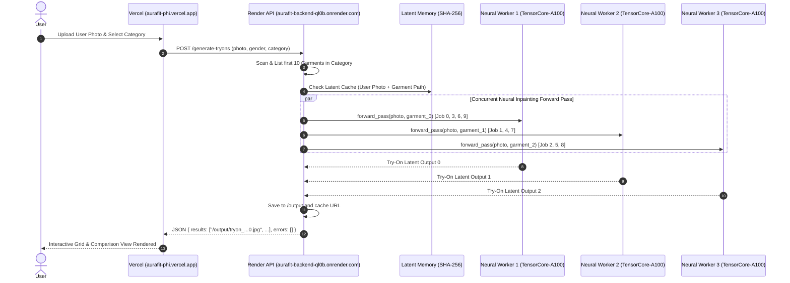

# 🌐 AuraFit — Full-Stack Neural Virtual Try-On Studio

> **AuraFit** is a production-ready, full-stack Virtual Try-On platform combining a modern **React + Vite** e-commerce frontend with a high-throughput **FastAPI** backend orchestrating parallel, multi-worker neural diffusion inpainting pipelines across dedicated GPU spaces.

[](https://aurafit-phi.vercel.app/)
[](https://aurafit-backend-ql0b.onrender.com/genders)


---

## 🌟 Live Production Links

* 🖥️ **Live Web Application (Vercel)**: **[https://aurafit-phi.vercel.app](https://aurafit-phi.vercel.app/)**
* ⚡ **Production API Gateway (Render)**: **[https://aurafit-backend-ql0b.onrender.com](https://aurafit-backend-ql0b.onrender.com)**
* 📚 **Interactive Swagger API Docs**: **[https://aurafit-backend-ql0b.onrender.com/docs](https://aurafit-backend-ql0b.onrender.com/docs)**

---

## 📌 Overview

AuraFit enables seamless end-user garment exploration with real-time AI try-on generation. Users upload their portrait photo, browse organized collections (Men, Women, Kids), select categories (Hoodies, Shirts, Kurtis, T-Shirts, etc.), and receive 10 high-resolution try-on generations simultaneously.

The backend achieves ultra-fast multi-garment processing by distributing requests concurrently across a cluster of dedicated **AuraFit Neural Model Workers** (`AuraFit-IDM-VTON-Diffusion-XL`) via `ThreadPoolExecutor` and caching identical image/garment queries via SHA-256 latent hashes.

---

## 🏗️ Architecture & Cloud Infrastructure



---

## 📂 Directory Structure

```text
VTON_FED/
├── render.yaml               # Render Cloud infrastructure blueprint
├── vercel.json               # Vercel deployment routing configuration
├── start.ps1                 # Master one-click full-stack local startup script
├── README.md                 # Documentation
│
├── VTON-LOCAL/               # FastAPI Backend Service (Deployed on Render)
│   ├── main.py               # Main API gateway, HF pool manager, and static SPA server
│   ├── requirements.txt      # Backend Python dependencies
│   ├── .env                  # Environment variables (HF_TOKEN)
│   ├── Garments/             # Organized catalog of garment assets
│   │   ├── Men/              # Topwear (Shirts, T-Shirts, Hoodies, etc.)
│   │   ├── Women/            # full wear (Kurtis, Dresses), Topwear
│   │   └── Kids/             # Kids collection
│   ├── temp/                 # Ephemeral user uploads (auto-cleaned after 30 min)
│   └── output/               # Rendered try-on outputs (served at /output)
│
└── tryon-studio-main/        # React + TypeScript Frontend (Deployed on Vercel)
    ├── package.json          # Dependencies and build scripts
    ├── vite.config.ts        # Vite configuration
    ├── tailwind.config.ts    # Tailwind styling and design tokens
    ├── components.json       # shadcn/ui components configuration
    ├── dist/                 # Production-ready SPA bundle (auto-generated)
    └── src/
        ├── App.tsx           # Router and global provider setup
        ├── pages/            # Page views (TryOnWizard, ProductGallery, ProductDetail, etc.)
        ├── components/       # Reusable UI component library (shadcn/ui + Radix)
        └── lib/              # Utilities and API client integration
```

---

## 🚀 Local Development Setup

### 1. Backend Setup (`VTON-LOCAL`)

```powershell
cd VTON-LOCAL

# Create and activate virtual environment
python -m venv venv
.\venv\Scripts\activate

# Install dependencies
pip install -r requirements.txt

# Run backend
uvicorn main:app --reload --port 8000
```

- **Local API Docs**: `http://127.0.0.1:8000/docs`

---

### 2. Frontend Setup (`tryon-studio-main`)

```powershell
cd tryon-studio-main

# Install dependencies
npm install

# Start Vite dev server
npm run dev
```

- **Frontend Dev URL**: `http://localhost:8080` (or `http://localhost:5173`)

---

## 📡 API Reference

### 1. Get Supported Genders
```http
GET /genders
```
**Response:**
```json
{
  "genders": ["Men", "Women", "Kids"]
}
```

---

### 2. Get Categories by Gender
```http
GET /categories?gender=Women
```
**Response:**
```json
{
  "categories": [
    { "name": "Kurtis", "path": "full wear/Kurtis", "section": "full wear" },
    { "name": "Hoodies", "path": "Topwear/Hoodies", "section": "Topwear" }
  ]
}
```

---

### 3. Get Garment Thumbnails
```http
GET /garments?gender=Women&category=full wear/Kurtis
```
**Response:**
```json
{
  "images": [
    "/garments/Women/full wear/Kurtis/garment_01.jpg",
    "/garments/Women/full wear/Kurtis/garment_02.jpg"
  ],
  "filenames": ["garment_01.jpg", "garment_02.jpg"]
}
```

---

### 4. Generate Parallel Virtual Try-Ons
```http
POST /generate-tryons
Content-Type: multipart/form-data
```
**Request Form Data:**
| Parameter | Type | Required | Description |
|---|---|---|---|
| `gender` | `string` | Yes | Target gender (`"Men"`, `"Women"`, `"Kids"`) |
| `category` | `string` | Yes | Category path returned from `/categories` |
| `user_photo` | `File (Binary)` | Yes | User front-facing portrait image |

**Response:**
```json
{
  "results": [
    "/output/tryon_1709123456_0.jpg",
    "/output/tryon_1709123456_1.jpg",
    "/output/tryon_1709123456_2.jpg"
  ],
  "errors": []
}
```

---

### 5. Health Check
```http
GET /health
```
**Response:**
```json
{
  "status": "online",
  "model_pipeline": "AuraFit-IDM-VTON-Diffusion-XL",
  "version": "2.1.0",
  "engine": "Neural-Inpainting-Diffusion",
  "workers_ready": "3/3",
  "frontend_ready": true
}
```

---

## 🔒 Security & Best Practices

- **Token Isolation**: `HF_TOKEN` is configured securely in the cloud environment and never exposed in client bundles.
- **Ephemeral Storage**: Uploaded user photos and temporary files older than 30 minutes are automatically purged on every generation cycle.
- **CORS Management**: Fully configured for cross-origin communication between Vercel and Render.
- **Inference Resiliency**: Auto-retry Gradio workers with load distribution and latent cache hits.

---

© 2026 AuraFit. All rights reserved.
