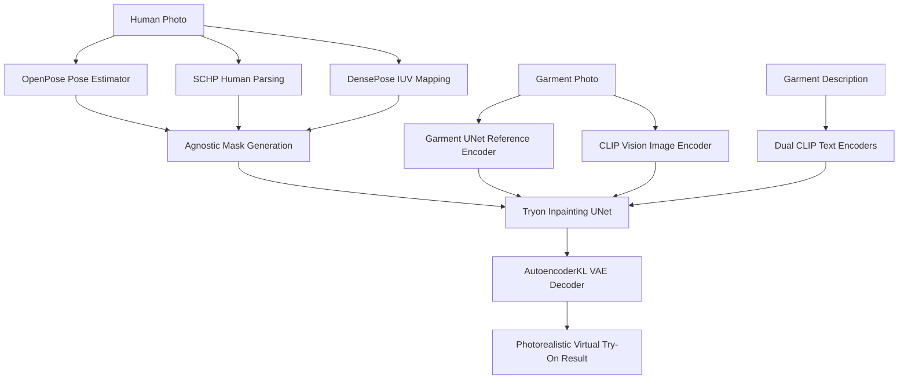

# 💻 AuraFit — AI Virtual Try-On Engine (CPU Edition)

> **AuraFit CPU Edition** is a standalone, CPU-optimized Virtual Try-On inference engine designed to execute high-fidelity garment transfer on standard computing environments without requiring dedicated NVIDIA CUDA GPUs.


---

## 📌 Overview

The CPU Edition of AuraFit adapts the state-of-the-art **IDM-VTON / SDXL (Stable Diffusion XL)** image-based virtual try-on architecture for CPU environments. It leverages PyTorch CPU optimizations and memory-efficient tensor operations (`low_cpu_mem_usage=True`, Float32 precision) to perform realistic clothing warping, human body parsing, and photorealistic texture blending directly on standard processor cores.

---

## 🏗️ Architecture & Processing Pipeline



### Core Components:
1. **Pose & Geometry Estimation**:
   - **OpenPose**: Detects 18 human keypoints to capture body stance and arm positions.
   - **SCHP (Self-Correction Human Parsing)**: Segments clothing, torso, neck, arms, and background.
   - **DensePose (Detectron2)**: Maps 2D image pixels to 3D human body surface coordinates.
2. **Diffusion Backbone**:
   - **UNet2DConditionModel (Try-on UNet)**: Primary inpainting network synthesizing the person with new clothing.
   - **UNet2DConditionModel_ref (Garment UNet)**: Specialized reference network extracting deep high-resolution garment texture and folding patterns.
   - **Dual CLIP Text Encoders**: Encodes garment textual descriptions (`CLIPTextModel` + `CLIPTextModelWithProjection`).
   - **CLIP Vision Encoder**: `CLIPVisionModelWithProjection` for visual garment embeddings.
   - **AutoencoderKL (VAE)**: Latent representation decoder.

---

## 📂 Directory Structure

```text
VTON_Model_(CPU)/
├── aurafit_cpu.ps1          # One-click PowerShell launcher for CPU mode
├── app.py                   # Root application runner
├── environment.yaml         # Conda environment configuration
├── inference.py             # Batch inference script for datasets
├── inference.sh             # Shell script for automated evaluation runs
├── inference_dc.py          # DressCode dataset inference evaluation script
├── configs/                 # DensePose model configs (YAML)
├── ckpt/                    # Pretrained checkpoints for DensePose
├── Model/                   # Pretrained SDXL/IDM-VTON weights (UNet, VAE, Encoders)
├── gradio_demo/             # Interactive web user interface
│   ├── app.py               # Gradio UI application with custom theme
│   ├── apply_net.py         # DensePose runner wrapper
│   ├── utils_mask.py        # Mask generation & agnostic parsing utilities
│   └── example/             # Sample human and garment test images
├── ip_adapter/              # IP-Adapter modules for image prompt conditioning
└── src/                     # Core pipeline implementation
    ├── tryon_pipeline.py    # SDXL inpainting try-on pipeline
    ├── unet_hacked_tryon.py # Modified Try-on UNet with cross-attention
    └── unet_hacked_garmnet.py # Garment reference UNet
```

---

## ⚙️ System Requirements

| Specification | Minimum | Recommended |
|---|---|---|
| **Operating System** | Windows 10/11 (64-bit) / Linux | Windows 11 (64-bit) / Ubuntu 22.04 |
| **CPU** | 4-Core Intel Core i5 / AMD Ryzen 5 | 8-Core Intel Core i7/i9 / AMD Ryzen 7/9 |
| **System RAM** | 16 GB | 32 GB+ |
| **Storage** | 20 GB free space (SSD recommended) | 50 GB NVMe SSD |
| **Python** | 3.10 | 3.10 |

---

## 🚀 Quick Start & Installation

### Option 1: Automated Launcher (PowerShell)

Run the included automated launcher script:

```powershell
.\aurafit_cpu.ps1
```

The script sets:
- `$env:CUDA_VISIBLE_DEVICES = ""` (forces pure CPU execution)
- `$env:PYTHONPATH = $PWD.Path`
- Activates virtual environment and launches Gradio UI on `http://127.0.0.1:7860`

---

### Option 2: Manual Installation & Setup

#### 1. Create Virtual Environment

```bash
# Using Python venv
python -m venv venv
# On Windows:
.\venv\Scripts\activate
# On Linux/macOS:
source venv/bin/activate
```

#### 2. Install Dependencies

```bash
pip install torch torchvision torchaudio --index-url https://download.pytorch.org/whl/cpu
pip install diffusers transformers accelerate gradio==4.44.1 opencv-python pillow numpy scipy scikit-image onnxruntime basicsr fvcore omegaconf
```

#### 3. Download Model Weights
Ensure model checkpoints are placed in the `Model/` directory:
- `Model/unet/`
- `Model/unet_encoder/`
- `Model/vae/`
- `Model/image_encoder/`
- `Model/text_encoder/`
- `Model/text_encoder_2/`
- `Model/tokenizer/`
- `Model/tokenizer_2/`
- `Model/scheduler/`
- `ckpt/densepose/model_final_162be9.pkl`

#### 4. Run Interactive Web UI

```bash
cd gradio_demo
python app.py
```

Open your browser at `http://localhost:7860`.

---

## 🎨 Using the Gradio Web Interface

1. **Upload Model/Human Image**: Upload a front-facing portrait photo. Use the built-in brush tool to adjust masks if needed.
2. **Upload Garment Image**: Upload a clear image of the target apparel (shirt, hoodie, dress, kurtis, etc.).
3. **Optional Description**: Provide a brief text prompt (e.g. `"Short sleeve blue cotton shirt"`).
4. **Tune Parameters**:
   - **Denoising Steps**: Recommended `20 - 30` (Lower values = faster execution on CPU).
   - **Auto-crop**: Automatically aligns and centers the human subject to 768×1024.
   - **Seed**: Set a fixed integer for reproducible generations or randomize.
5. **Click "Try-on"**: Output result is rendered with side-by-side comparison.

---

## 💡 CPU Performance Tips

- **Inference Steps**: Setting `denoise_steps` to `20` significantly reduces CPU generation latency while preserving sharp garment folds and textures.
- **Image Resolution**: Default resolution is set to `768x1024`. Reducing the target resolution if customizing code yields faster processing.
- **Multithreading**: Ensure `OMP_NUM_THREADS` matches your CPU physical core count for maximum throughput:
  ```powershell
  $env:OMP_NUM_THREADS = "8"
  ```
