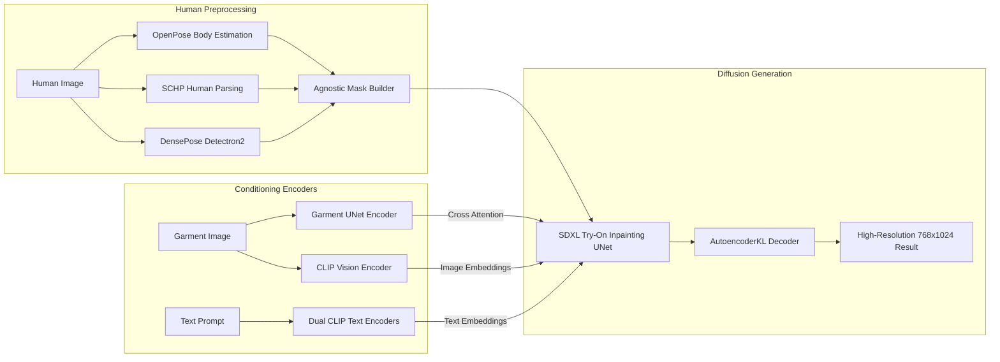

# ⚡ AuraFit — AI Virtual Try-On Studio (GPU Edition)

> **AuraFit GPU Edition** is a high-performance, CUDA-accelerated Virtual Try-On deep learning suite featuring real-time diffusion inference, multi-GPU batch benchmarking, and end-to-end SDXL fine-tuning pipelines.


-purple.svg)


---

## 📌 Overview

AuraFit GPU Edition delivers industrial-grade Virtual Try-On performance by harnessing modern NVIDIA tensor cores and half-precision (`torch.float16`) execution. Powered by **IDM-VTON** on an **SDXL (Stable Diffusion XL)** backbone, it accurately preserves garment logos, complex textures, embroideries, and natural fabric drapery around human geometry.

In addition to interactive web-based try-on, this module contains full pipelines for **batch evaluation** on benchmark datasets (VITON-HD, Zalando, DressCode) and **fine-tuning** custom diffusion models using Hugging Face `accelerate` and 8-bit Adam.

---

## 🏗️ Deep Learning Architecture



### Key Modules:
- **Modified Inpainting UNet (`UNet2DConditionModel`)**: Combines spatial latents of masked human body, pose, DensePose UV features, and garment reference encodings.
- **Garment Reference UNet (`UNet2DConditionModel_ref`)**: Extracts hierarchical multi-scale feature maps from the garment image.
- **OpenPose & Human Parsing (SCHP)**: Ensures clean separation between existing clothes, head, hands, and background.
- **DensePose R-CNN**: Incorporates 3D surface awareness to handle body rotations, poses, and angles.
- **Accelerated Memory Management**: Utilizes `torch.float16`, `low_cpu_mem_usage=True`, and gradient checkpointing.

---

## 📂 Directory Structure

```text
VTON_Model_(GPU)/
├── aurafit_gpu.ps1          # One-click launcher for GPU Gradio Web UI
├── setup_gpu.ps1            # PyTorch CUDA 11.8 environment auto-installer
├── requirements.txt         # GPU-specific Python dependencies
├── environment.yaml         # Conda environment manifest
├── inference.py             # Accelerate-enabled batch evaluation runner (Zalando / VITON-HD)
├── inference.sh             # Bash runner for batch evaluation scripts
├── inference_dc.py          # DressCode evaluation script (Upper, Lower, Dresses)
├── train_xl.py              # SDXL virtual try-on training pipeline
├── train_xl.sh              # Multi-GPU training launcher script
├── scan.py                  # Dataset integrity validator & parser
├── view_dump.py             # Debug dump inspector for intermediate masks & tensors
├── vitonhd_train_tagged.json# Annotated dataset index for training
├── vitonhd_test_tagged.json # Annotated dataset index for testing
├── Model/                   # Pretrained SDXL/IDM-VTON weights
├── ckpt/                    # Pretrained DensePose weights (model_final_162be9.pkl)
├── configs/                 # Detectron2 DensePose configuration files
├── preprocess/              # Human parsing and OpenPose preprocessing modules
│   ├── humanparsing/        # SCHP parsing inference scripts
│   └── openpose/            # OpenPose keypoint estimation scripts
├── src/                     # Core neural network modules and tryon pipeline
└── gradio_demo/             # Interactive web application
    ├── app.py               # Main Gradio application with custom styling
    ├── apply_net.py         # DensePose runner wrapper
    ├── utils_mask.py        # Mask generation utilities
    └── example/             # Preloaded test human models and garments
```

---

## ⚙️ Hardware & Software Requirements

| Component | Minimum | Recommended |
|---|---|---|
| **GPU** | NVIDIA GPU with 8 GB VRAM | NVIDIA RTX 3080 / 4080 / 4090 / A100 (12–24 GB+ VRAM) |
| **CUDA** | CUDA 11.8 / 12.1 | CUDA 11.8 / 12.1 + cuDNN 8.7+ |
| **System RAM** | 16 GB | 32 GB+ |
| **Python** | 3.10 | 3.10 |
| **Storage** | 25 GB NVMe SSD | 50 GB NVMe SSD |

---

## 🚀 Installation & Setup

### 1. Environment Setup

Run the automated GPU environment configuration script:

```powershell
.\setup_gpu.ps1
```

Or manually install PyTorch with CUDA 11.8 support:

```bash
# Create virtual environment
python -m venv venv
.\venv\Scripts\activate

# Install PyTorch with CUDA 11.8
pip install torch torchvision torchaudio --index-url https://download.pytorch.org/whl/cu118

# Install dependencies
pip install -r requirements.txt
```

### 2. Verify GPU Acceleration

```bash
python -c "import torch; print(f'CUDA Available: {torch.cuda.is_available()} | Device: {torch.cuda.get_device_name(0)} | VRAM: {torch.cuda.get_device_properties(0).total_memory / 1024**3:.2f} GB')"
```

---

## 🖥️ Running the Interactive Studio

### Launch via PowerShell:
```powershell
.\aurafit_gpu.ps1
```

### Launch Manually:
```bash
cd gradio_demo
python app.py
```

The Gradio interface will start at `http://localhost:7860`.

### UI Features:
- 🖼️ **Dual Upload Canvas**: Upload full-body model photo + garment image.
- 🖌️ **Interactive Inpainting Brush**: Fine-tune or custom-draw body preservation masks.
- 📐 **Auto-Crop & Alignment**: Automatically normalizes bounding boxes to 768×1024.
- 🎛️ **Hyperparameter Controls**: Adjust Denoising Steps (20–40), Guidance Scale, and Seed.

---

## 📊 Batch Evaluation & Benchmarking

Run batch evaluation over test datasets using Hugging Face `accelerate`:

### Paired / Unpaired Evaluation (Zalando / VITON-HD):
```bash
accelerate launch inference.py \
    --pretrained_model_name_or_path "./Model" \
    --width 768 \
    --height 1024 \
    --num_inference_steps 30 \
    --output_dir "result" \
    --unpaired \
    --data_dir "./Dataset/zalando" \
    --seed 42 \
    --test_batch_size 2 \
    --guidance_scale 2.0
```

### DressCode Evaluation by Category:
```bash
# Upper Body, Lower Body, or Dresses
accelerate launch inference_dc.py \
    --pretrained_model_name_or_path "./Model" \
    --width 768 \
    --height 1024 \
    --num_inference_steps 30 \
    --output_dir "result" \
    --unpaired \
    --data_dir "./Dataset/DressCode" \
    --seed 42 \
    --test_batch_size 2 \
    --guidance_scale 2.0 \
    --category "upper_body"
```

---

## 🧠 Fine-Tuning & Training

To train the virtual try-on diffusion pipeline on custom apparel collections:

```bash
CUDA_VISIBLE_DEVICES=0,1,2,3 accelerate launch train_xl.py \
    --pretrained_model_name_or_path "./Model" \
    --gradient_checkpointing \
    --use_8bit_adam \
    --output_dir="./checkpoints/vton_custom" \
    --train_batch_size=6 \
    --data_dir="./Dataset/zalando" \
    --learning_rate=1e-5 \
    --max_train_steps=50000
```

---

## 🔧 Troubleshooting

| Issue | Solution |
|---|---|
| `CUDA out of memory (OOM)` | Lower `test_batch_size` to `1`, reduce image resolution to `512x768`, or enable gradient checkpointing. |
| `Torch not compiled with CUDA enabled` | Re-run `.\setup_gpu.ps1` or reinstall PyTorch using the official CUDA wheel index. |
| `DensePose checkpoint not found` | Verify `ckpt/densepose/model_final_162be9.pkl` exists. |
| `Detectron2 build issues on Windows` | Ensure Visual Studio C++ Build Tools 2019/2022 are installed. |
